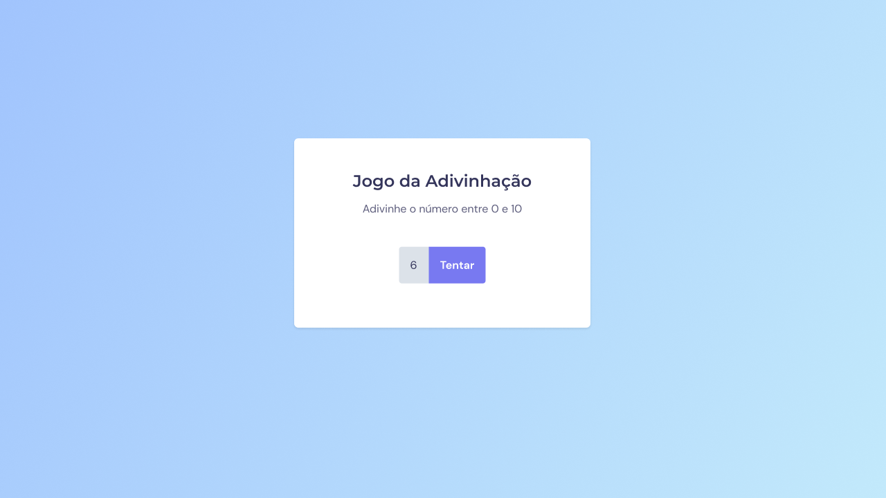
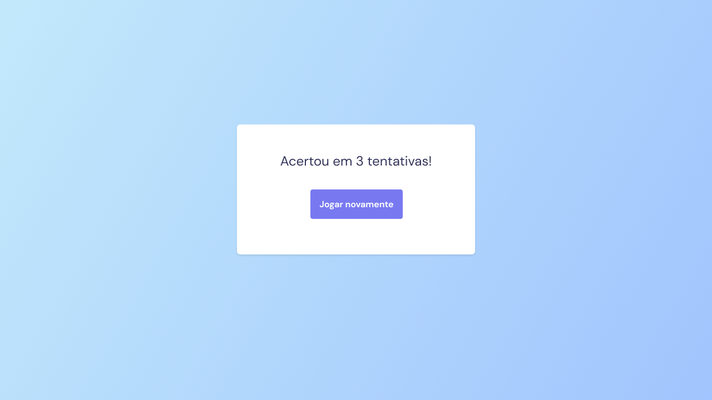

<h1 align="center"> Guess the Number 🤔🎰</h1>

 

## 💻 About this project

This project was provided by Rocketseat course that the goal is build a game called Guess the Number, after you win, it should shows how many attempts you've tried.

Demo link: https://rguessthenumber.netlify.app/

## 🔖 Layout

You can view the project's layout from [this link](<https://www.figma.com/file/bKEz58ks5vgDuTieaJdgsX/Jogo-Adivinha%C3%A7%C3%A3o-(Copy)?type=design&node-id=5%3A114&mode=design&t=6KlQJ7kpZIJcqljf-1>). To access is neccessary to have an account on [Figma](https://figma.com).

## ⚡️ Techs

This project was developed using this following techs:

- HTML & CSS
- JavaScript
- Git & Github
- Figma

## 🖥️ Screenshot

    
    

This project was developed following the instructions from Rocketseat - :rocket: [Rocketseat community on Discord](https://discord.gg/rocketseat)
